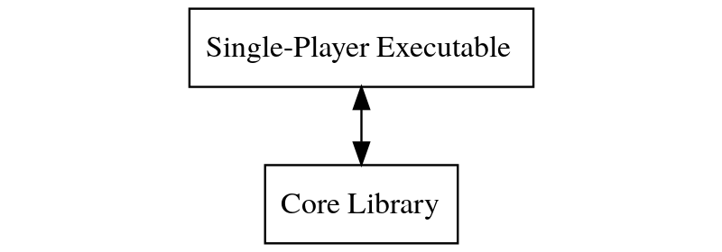
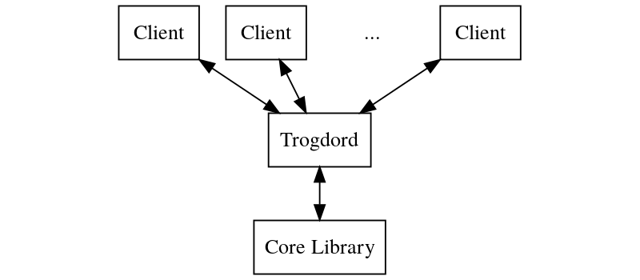
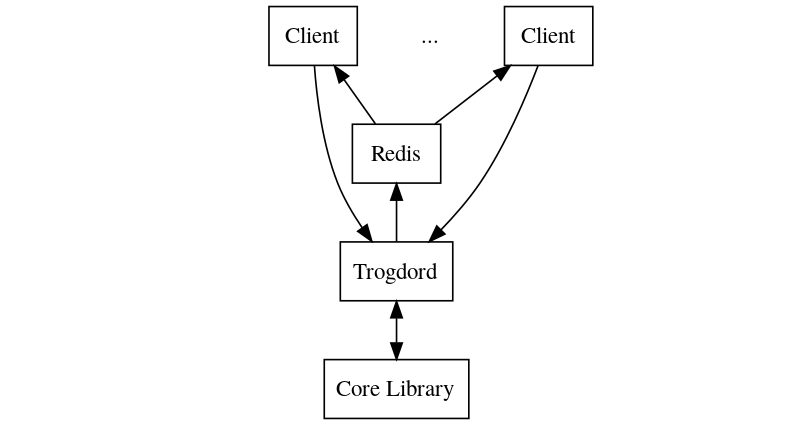

  

# Trogdor++

A unified engine for building text adventures and MUDs with batteries included.

## Introduction

Trogdor++ provides you with all the tools you need to build a solid interactive fiction experience, from offline single-player text adventures to massive online MUDs and everything in-between.

At the heart of Trogdor++ is the core library, written in C++. This library supports all the basic features necessary to build a basic game out of the box with no programming required. For features that aren't baked into the library itself, Trogdor++ also includes bindings that make it straightforward to extend using both Lua and C++.

Trogdor++ is a work in progress and more features are being added all the time.

## Overview

This repository includes the following modules:

* [src/core](src/core/README.md): The core library, written in C++
* [src/standalone](src/standalone/README.md): A barebones single-player CLI client, written primarily as a demonstration for how to use the library
* [src/trogdord](src/trogdord/README.md): A queryable TCP server capable of hosting multi-player games with optional support for [Redis Pub/Sub](https://redis.io/topics/pubsub)
* [src/php7/trogdord](src/php7/trogdord/README.md): A PHP 7 client for trogdord, implemented as an extension in C++
* [src/nodejs/trogdord](src/nodejs/trogdord/README.md): A Node.js client for trogdord, written in Javascript

Descriptions of each component, along with build instructions, can be found by clicking the links above.

## How it Works

At a high level, the modules in this project are built to work together in the following configurations:

### Standalone Single-Player Games

In this configuration, a client application links against the core library in order to drive games with a single player. In [src/standalone](src/standalone/README.md), you'll find a C++ application demonstrating this use case. This is what you would prefer if you wanted to write a simple console-based text adventure.

At the moment, this isn't intended for actual use but to serve as an example for how you might go about building your own single player application. I intend to build this out more fully in the future, but for now, most of my attention is directed toward improving the multi-player aspects of the engine.

### Hosted Multi-Player Games

Trogdor++ includes an optional TCP server ([src/trogdord](src/trogdord/README.md)) capable of hosting many multi-player games in parallel. There are a few different ways this can be configured, each of which is outlined below.

#### Trogdord Without Redis

Here, input and output pass directly through trogdord. To actually host games would require polling for output and wouldn't be very efficient, but it's easy to setup and is useful for testing and other one-off tasks. Note that querying trogdord directly is still possible even when using the Redis configuration described below.

#### Trogdord With Redis

With this setup, trogdord will send output to a [Redis Pub/Sub](https://redis.io/topics/pubsub) channel, which will then be consumed by one or more clients. Input and other requests to the game server will, meanwhile, flow directly from one or more clients back to trogdord.

An example of this pattern in action is my sister project, [Trogserve](https://github.com/crankycyclops/trogserve). In that case, there's a [WebSocket](https://developer.mozilla.org/en-US/docs/Web/API/WebSockets_API) server on the backend that subscribes to the configured Redis channel for output, forwarding it to the browser, and receives input from the browser, sending it to trogdord via a request.

### Other Configurations

Other configurations are, of course, possible. You could host single player games online via trogdord, or support multi-player games locally through a custom executable with multiple input devices. You can link any application to core for any purpose; what you choose to do with it is limited only by your imagination :)

## Experimental Inform 7 Support

As a programming exercise, I've been working on support for [Inform 7](http://inform7.com/). It's a tricky endeavor, not only because Inform 7 is closed source (at the moment, although that's supposed to change [someday](https://news.ycombinator.com/item?id=20421189)), but because Inform 7 and Trogdor-pp don't share all the same goals (Inform 7 compiles down to [Z-Code](https://en.wikipedia.org/wiki/Z-machine) and is only for single player games, while Trogdor-pp uses higher level primitives and supports more than one player) and because Inform 7 supports features that don't yet exist or have been implemented differently in Trogdor-pp.

The subset of the language that I currently parse is too limited to be useful, so trogdord doesn't support it. However, if you want to play with the parser and see what it can do, the standalone client is equipped to load single-file Inform 7 games.

To read more about what I currently support, including an EBNF of the limited grammar my parser can understand, take a look at [src/core/include/trogdor/parser/parsers/inform7parser.h](https://github.com/crankycyclops/trogdor-pp/blob/master/src/core/include/trogdor/parser/parsers/inform7parser.h).

## Copyright and License

Trogdor++ is licensed under the [GPL 3.0](https://www.gnu.org/licenses/gpl-3.0.en.html) and is Copyright © 2013 - Present by James Colannino.

## History

Trogdor++ is the C++ version of the [Trogdor Text Adventure Engine](https://github.com/crankycyclops/trogdor "Trogdor Text Adventure Engine"), originally written in C.  That project is no longer maintained but still exists on GitHub (in an archived state) for historical purposes.

**Fun fact:** the name Trogdor comes from [this video](https://www.youtube.com/watch?v=90X5NJleYJQ) :)

Have fun!